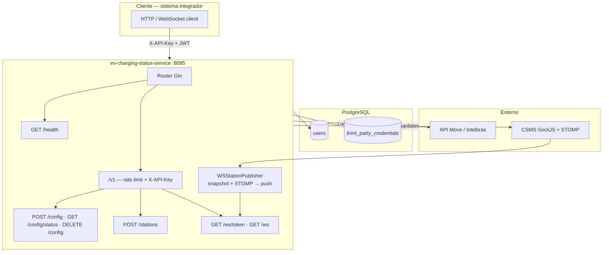

<div align="center">

# ⚡ EV Charging Status Service

**Microserviço em Go para monitoramento em tempo real de estações de recarga (EV)**

Autentica na API Move/Intelbras, consulta estações e conectores, e entrega status por **WebSocket** e **HTTP** — por usuário, com JWT no handshake.

<br/>

[](https://go.dev/)
[](https://gin-gonic.com/)
[](https://www.postgresql.org/)
[](https://www.docker.com/)
[](#fluxo-de-dados)

<br/>

```bash
docker compose up -d --build
# → API em http://localhost:8085
# → Swagger em http://localhost:8085/swagger/index.html
```

</div>

---

## Por que este serviço?

Integrações com o CSMS Move/Intelbras precisam de status de conectores **sem poluir a API externa com polling**. Este serviço:

- Guarda credenciais por usuário (criptografadas)
- Emite JWT curto para o cliente
- Envia um **snapshot** ao conectar no WebSocket
- Atualiza o cliente via **STOMP do CSMS** quando `status`, `errorCode` ou `erroInfo` mudam — sem poll periódico

Ideal para backends e apps que precisam de painel ao vivo de estações EV.

---

## Destaques

| | |
|---|---|
| **Push em tempo real** | WebSocket com snapshot inicial + eventos STOMP do CSMS |
| **Mesmo contrato HTTP/WS** | `POST /v1/stations` e o push WS usam o mesmo JSON (`userId`, `stations`, `timestamp`) |
| **Credenciais seguras** | Senha e API key criptografadas (AES-256-GCM) com `ENCRYPTION_KEY` |
| **Auth em camadas** | `X-API-Key` nas rotas HTTP + JWT curto só no handshake WS |
| **Rate limit** | 15 req/min por IP no grupo `/v1` |
| **Swagger** | OpenAPI embutida e regenerável com `swag` |
| **Docker-first** | API + PostgreSQL com um comando |

> Redis e Kafka aparecem no `go.mod` para evolução futura; **não são usados** na versão atual.

---

## Índice

- [Stack](#stack)
- [Arquitetura](#arquitetura)
- [Fluxo de dados](#fluxo-de-dados)
- [Quick start](#quick-start)
- [Variáveis de ambiente](#variáveis-de-ambiente)
- [API](#api)
- [Swagger](#swagger)
- [Migrations](#migrations)
- [Segurança](#segurança)
- [Estrutura do projeto](#estrutura-do-projeto)

---

## Stack

| Tecnologia | Papel |
|------------|--------|
| **Go 1.25** | Runtime e linguagem |
| **Gin** | API HTTP |
| **Gorilla WebSocket** | Conexões WS autenticadas por JWT |
| **PostgreSQL 16** | Usuários, credenciais e domínio |
| **SockJS + STOMP** | Assinatura de status no CSMS Move |
| **Docker / Compose** | Build e runtime local |

---

## Arquitetura



### Componentes

| Componente | O que faz |
|------------|-----------|
| **API HTTP** | Porta **8085**. Health, config, stations, token WS, upgrade WS e stats. |
| **Push WS** | Um `GET /chargepoints` no connect → snapshot. Com STOMP ativo, reenvia o mesmo formato a cada mudança relevante. |
| **PostgreSQL** | Usuários e credenciais (criptografadas quando `ENCRYPTION_KEY` está definida). |

---

## Fluxo de dados

```text
1. POST /v1/config          → login Move + persiste credenciais + devolve JWT WS (sem expiresIn)
2. GET  /v1/ws?token=...    → upgrade WebSocket (só JWT, sem X-API-Key)
3. Servidor                 → 1 frame JSON (snapshot completo)
4. CSMS STOMP (opcional)    → mudanças de conector → mesmo JSON atualizado
5. POST /v1/stations        → mesma carga via HTTP (Bearer JWT + apiKey no body)
```

A sessão JWT vale até `DELETE /v1/config` ou idle sem tráfego de aplicação no WebSocket (`WS_IDLE_TIMEOUT_SECONDS`).

### WebSocket em detalhe

- **Handshake:** `?token=<JWT>` ou `Authorization: Bearer <JWT>`. Token inválido, usuário removido ou sessão idle → **401** (sem upgrade).
- **Sessão:** sem `expiresIn`/`exp` fixo. Idle configurável via `WS_IDLE_TIMEOUT_SECONDS` (default `3600`). Ping/pong **não** renovam a sessão; push JSON e mensagens do cliente renovam. Idle → fecha WS e invalida JWT.
- **Delete:** `DELETE /v1/config` remove o usuário e **fecha** conexões WS abertas desse `userId`.
- **Transporte:** ping a cada **25s**; fila de **32** mensagens por conexão (backpressure — cliente lento pode ser desconectado).
- **Isolamento:** o hub só publica para conexões do mesmo `userId` do JWT.
- **STOMP off:** com `CSMS_STATUS_STOMP_ENABLED=false`, só o snapshot inicial é enviado.

---

## Quick start

### Docker Compose (recomendado)

```bash
cp .env.example .env
# edite API_KEY, INTELBRAS_BASE_URL, ENCRYPTION_KEY, etc.

docker compose up -d --build
docker compose logs -f
```

| Recurso | URL |
|---------|-----|
| API | http://localhost:8085 |
| Health | http://localhost:8085/health |
| Swagger UI | http://localhost:8085/swagger/index.html |

### Migrations

A API aplica automaticamente os `.sql` de `migrations/` no startup (tabela `schema_migrations`). Em bancos já existentes, `001`–`004` são marcadas como aplicadas e só as novas (ex.: `005`) rodam.

Para aplicar manualmente (Beekeeper / psql), após o primeiro `up`:

```bash
# Linux / macOS
cat migrations/001_init.sql \
    migrations/002_webhook_events_payload_text.sql \
    migrations/003_third_party_credentials_unique_user.sql \
    migrations/004_drop_webhooks.sql \
    migrations/005_ws_session_activity.sql \
  | docker exec -i ev-charging-db psql -U postgres -d charging
```

```powershell
# Windows (PowerShell)
Get-Content migrations/001_init.sql | docker exec -i ev-charging-db psql -U postgres -d charging
Get-Content migrations/002_webhook_events_payload_text.sql | docker exec -i ev-charging-db psql -U postgres -d charging
Get-Content migrations/003_third_party_credentials_unique_user.sql | docker exec -i ev-charging-db psql -U postgres -d charging
Get-Content migrations/004_drop_webhooks.sql | docker exec -i ev-charging-db psql -U postgres -d charging
Get-Content migrations/005_ws_session_activity.sql | docker exec -i ev-charging-db psql -U postgres -d charging
```

A migration `003` remove credenciais duplicadas por `user_id` e cria índice único (necessário para upsert e para evitar rajadas no WebSocket).

### Local (sem Docker)

1. PostgreSQL com banco `charging`
2. Exporte as variáveis (o `go run` **não** carrega `.env` sozinho)
3. Rode:

```bash
go run cmd/api/main.go
```

---

## Variáveis de ambiente

Copie `.env.example` → `.env`. No Compose, o serviço `api` consome essas variáveis.

| Variável | Obrigatória | Descrição |
|----------|:-----------:|-----------|
| `POSTGRES_URL` | ✅ | URL Postgres, ex.: `postgres://user:pass@db:5432/charging?sslmode=disable` |
| `INTELBRAS_BASE_URL` | ✅ | Base da API Move/Intelbras |
| `API_KEY` | ✅* | Header `X-API-Key`. Use `ALLOW_EMPTY_API_KEY=true` só em dev |
| `ENCRYPTION_KEY` | — | AES-256-GCM para senha/API key no banco (UUID, senha ou base64 32 bytes). Vazia = texto plano |
| `WS_JWT_SECRET` | —* | Segredo do JWT WS. Vazio → fallback em `API_KEY` |
| `WS_IDLE_TIMEOUT_SECONDS` | — | Sem tráfego de app no WS (ping/pong não conta) → fecha WS e invalida JWT (default `3600`) |
| `INTELBRAS_CHARGEPOINT_MAX_RPM` | — | Limite de `GET /chargepoints`/min neste processo (default `55`; `0` desliga) |
| `CSMS_STATUS_STOMP_ENABLED` | — | `true`/`false` — push incremental via STOMP (default `true`) |
| `CSMS_SOCKJS_PREFIX` | — | Prefixo SockJS no host Move (default `/ws`) |

---

## API

| Método | Rota | Auth | Descrição |
|--------|------|------|-----------|
| `GET` | `/health` | — | Health check |
| `POST` | `/v1/config` | `X-API-Key` | Configura email/senha (+ `apiKey` opcional). Resposta: `token` (sem `expiresIn`) |
| `GET` | `/v1/config/status` | `X-API-Key` | Indica se há config e token Intelbras (sem expor segredos) |
| `DELETE` | `/v1/config` | `X-API-Key` + Bearer JWT | Remove o usuário do JWT, fecha WS abertos → **204** |
| `POST` | `/v1/stations` | `X-API-Key` + Bearer JWT | Body `{"apiKey":"..."}`. Retorna `userId`, `timestamp`, `stations` |
| `GET` | `/v1/ws/token?username=` | `X-API-Key` | Emite JWT WS (`token` apenas) |
| `GET` | `/v1/ws` | **só JWT** | Upgrade WebSocket |
| `GET` | `/v1/ws/stats` | `X-API-Key` | Métricas do hub (conexões, mensagens, drops) |

Erros usam mensagens genéricas (`invalid request`, `configuration failed`, `stations unavailable`, …); o detalhe fica nos logs do servidor.

---

## Swagger

Com a API no ar:

- **UI:** http://localhost:8085/swagger/index.html  
- **JSON:** http://localhost:8085/swagger/doc.json  

Regenerar a partir dos comentários:

```bash
go install github.com/swaggo/swag/cmd/swag@latest
swag init -g cmd/api/main.go -o docs
```

---

## Migrations

| Arquivo | Descrição |
|---------|-----------|
| `001_init.sql` | Schema inicial (inclui legado de webhooks) |
| `002_webhook_events_payload_text.sql` | `payload` JSONB → TEXT (histórico) |
| `003_third_party_credentials_unique_user.sql` | Dedup + unique por `user_id` |
| `004_drop_webhooks.sql` | Remove tabelas de webhook (descontinuado) |
| `005_ws_session_activity.sql` | `users.ws_last_activity_at` para idle/invalidação de sessão JWT/WS |
| `clear_data.sql` | `TRUNCATE` dos dados, mantém estrutura |

---

## Segurança

- **`API_KEY`** — exigida no startup (exceto `ALLOW_EMPTY_API_KEY=true`); header `X-API-Key` em `/v1/*` (exceto handshake `/v1/ws`)
- **`WS_JWT_SECRET`** — assinatura do JWT WS; em produção use segredo dedicado
- **`ENCRYPTION_KEY`** — AES-256-GCM para credenciais no banco
- **Rate limit** — 15 req/min por IP no grupo `/v1`
- **Isolamento WS** — publicação apenas para o `userId` do JWT
- **Erros genéricos** — corpos de erro de terceiros não vão para o cliente
- **Logs** — sem segredos em claro

---

## Estrutura do projeto

```text
ev-charging-status-service/
├── cmd/api/                 # Entrypoint HTTP
├── docs/                    # Swagger (swag) + roadmaps
├── internal/
│   ├── api/                 # Handlers, rotas, rate limit, hub WS
│   ├── clients/
│   │   ├── intelbras/       # Login + charge-points
│   │   └── csmsstomp/       # Consumidor SockJS/STOMP
│   ├── config/              # Env
│   ├── crypto/              # ENCRYPTION_KEY
│   ├── database/            # Postgres (+ stub Redis)
│   ├── repository/          # Acesso a dados
│   ├── service/             # Config, stations, auth WS, publisher, STOMP
│   └── workers/             # Workers auxiliares
├── migrations/              # SQL de schema
├── scripts/                 # Utilitários
├── docker-compose.yml
├── Dockerfile               # Multi-stage
├── .env.example
└── README.md
```

---

<div align="center">

**EV Charging Status Service** — status de estações EV, em tempo real.

Feito com Go · Gin · PostgreSQL · WebSocket

</div>
