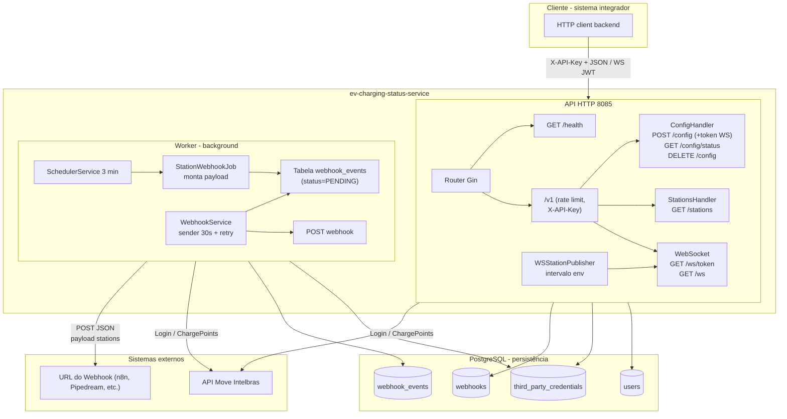

# EV Charging Status Service

Microserviço em Go para monitoramento de estações de recarga (EV). Autentica na API Move/Intelbras, consulta estações e conectores, pode enviar os dados por **webhook** (opcional) e faz **push periódico por WebSocket** por usuário (JWT no handshake).

---

## Índice

- [Stack](#stack)
- [Arquitetura](#arquitetura)
- [Fluxo de dados](#fluxo-de-dados)
- [Variáveis de ambiente](#variáveis-de-ambiente)
- [Como rodar](#como-rodar)
- [API](#api)
- [Documentação Swagger](#documentação-swagger)
- [Migrations](#migrations)
- [Segurança](#segurança)
- [Estrutura do projeto](#estrutura-do-projeto)

---

## Stack

| Tecnologia | Uso |
|------------|-----|
| **Go 1.25** | Linguagem |
| **Gin** | API HTTP |
| **Gorilla WebSocket** | Conexão WS + JWT curto (`WS_JWT_SECRET` / fallback `API_KEY`) |
| **PostgreSQL** | Persistência (usuários, credenciais, webhooks, eventos) |
| **Docker / Docker Compose** | API, Worker e banco em containers |

Redis e Kafka estão no `go.mod` para uso futuro; na versão atual não são utilizados.

---

## Arquitetura



### Componentes

| Componente | Descrição |
|------------|-----------|
| **API** | Servidor HTTP (porta **8085**). Expõe `/health`, `POST /v1/config` (retorna token WS), `GET /v1/config/status`, `DELETE /v1/config`, `GET /v1/stations`, `GET /v1/ws/token`, `GET /v1/ws` (upgrade WebSocket), `GET /v1/ws/stats`. Rotas `/v1/*` com `X-API-Key` (se `API_KEY` definida) e rate limit (15 req/min por IP). |
| **Worker** | Processo em background. A cada **3 minutos** executa o job: busca estações na Intelbras **por usuário** e enfileira webhook só para quem tem URL ativa. A cada **30 segundos** o sender processa `webhook_events` e faz POST com retentativas. |
| **Push WS (API)** | No mesmo processo da API, publicador envia JSON de estações **por `user_id`** no intervalo `WS_PUBLISH_INTERVAL_SECONDS` (default 180 s). Uma credencial por usuário no banco (migration `003`). |
| **PostgreSQL** | Armazena usuários, credenciais (senha e API key criptografadas com `ENCRYPTION_KEY`), webhooks e fila de eventos (`webhook_events`). |

---

## Fluxo de dados

1. **Configuração**  
   `POST /v1/config` com email, senha e, se quiser, `apiKey` (Intelbras) e `webhookUrl`. A API faz login na Move/Intelbras e persiste credenciais (criptografadas se `ENCRYPTION_KEY` estiver definida). A resposta inclui **`token` e `expiresIn`** para abrir o WebSocket sem chamar `/v1/ws/token`.

2. **Consulta de estações**  
   `GET /v1/stations` usa credenciais salvas (token Intelbras renovado quando necessário) e devolve estações/conectores.

3. **Webhook periódico (opcional)**  
   Se existir webhook ativo para o usuário, o worker a cada **3 min** enfileira um evento; o sender envia POST com retentativas e backoff (429/503 e `Retry-After`).

4. **WebSocket**  
   Cliente conecta em `ws://HOST:8085/v1/ws?token=JWT`. O servidor associa a conexão ao `user_id` do JWT e envia mensagens JSON (`userId`, `stations`, `timestamp`) só para esse usuário, no intervalo `WS_PUBLISH_INTERVAL_SECONDS`. Token inválido/expirado falha no handshake; conexão já aberta não é revalidada pelo TTL até reconectar.

---

## Variáveis de ambiente

Copie `.env.example` para `.env` e ajuste. No Docker Compose, as variáveis do `.env` são usadas nos serviços `api` e `worker`.

| Variável | Obrigatória | Descrição |
|----------|-------------|-----------|
| `POSTGRES_URL` | Sim | URL de conexão com o PostgreSQL (ex.: `postgres://user:pass@db:5432/charging?sslmode=disable`). |
| `INTELBRAS_BASE_URL` | Sim | Base da API Move/Intelbras (ex.: `https://cs-test.use-move.com/api/v1`). |
| `API_KEY` | Sim* | Chave para autorizar chamadas à API (`X-API-Key`). \* Use `ALLOW_EMPTY_API_KEY=true` só em dev. |
| `ENCRYPTION_KEY` | Não | Chave para criptografar senha e API key no banco. Pode ser UUID, senha ou base64 (32 bytes). Se vazia, dados ficam em texto. |
| `WS_JWT_SECRET` | Não* | Segredo para assinar o token curto do WebSocket. \* Se vazio, usa `API_KEY` como fallback. |
| `WS_TOKEN_TTL_SECONDS` | Não | TTL do token de conexão WS em segundos (default: `300`). |
| `WS_PUBLISH_INTERVAL_SECONDS` | Não | Intervalo de envio do WebSocket em segundos (default: `180`, 3 min, alinhado ao worker). |

---

## Como rodar

### Com Docker Compose (recomendado)

```bash
# Subir API, Worker e PostgreSQL
docker compose up -d --build

# Ver logs
docker compose logs -f
```

- **API**: http://localhost:8085  
- **Health**: http://localhost:8085/health  
- **Swagger**: http://localhost:8085/swagger/index.html  

### Aplicar migrations

Após o primeiro `up`, crie as tabelas (se ainda não existirem):

```bash
# Linux/macOS
cat migrations/001_init.sql migrations/002_webhook_events_payload_text.sql migrations/003_third_party_credentials_unique_user.sql | docker exec -i ev-charging-db psql -U postgres -d charging

# Windows (PowerShell)
Get-Content migrations/001_init.sql | docker exec -i ev-charging-db psql -U postgres -d charging
Get-Content migrations/002_webhook_events_payload_text.sql | docker exec -i ev-charging-db psql -U postgres -d charging
Get-Content migrations/003_third_party_credentials_unique_user.sql | docker exec -i ev-charging-db psql -U postgres -d charging
```

**Banco externo ou Beekeeper:** abra o SQL da pasta `migrations/` (incluindo `003_...`) e execute na ordem no seu Postgres; o `003` remove credenciais duplicadas por `user_id` e cria índice único (necessário para o upsert e para evitar rajadas no WebSocket).

### Local (sem Docker)

1. PostgreSQL rodando e banco `charging` criado.  
2. Defina as variáveis de ambiente. O `go run` **não carrega `.env` sozinho**; no PowerShell você pode injetar o arquivo antes de rodar ou exportar `POSTGRES_URL`, `API_KEY`, etc. manualmente.  
3. Rode a API e o worker em terminais separados:

```bash
go run cmd/api/main.go
go run cmd/worker/main.go
```

---

## API

| Método | Rota | Descrição |
|--------|------|-----------|
| GET | `/health` | Health check (sem autenticação). |
| POST | `/v1/config` | Configura credenciais (body: email e password obrigatórios; webhookUrl e apiKey opcionais) e já retorna token WS (`token`, `expiresIn`). Requer `X-API-Key` se `API_KEY` estiver definida. |
| DELETE | `/v1/config` | Remove o usuário informado (via body `email`/`username`) e todos os dados relacionados (credenciais, webhooks, eventos). |
| GET | `/v1/config/status` | Retorna se há configuração e se o token está presente (sem expor o token). |
| GET | `/v1/stations` | Lista estações da API de terceiros (usa token salvo ou renova). |
| GET | `/v1/ws/token?username={email}` | Emite token curto para handshake do WebSocket do usuário. Requer `X-API-Key`. |
| GET | `/v1/ws?token={jwt}` | Abre conexão WebSocket e recebe somente eventos do usuário do token. |
| GET | `/v1/ws/stats` | Exibe estatísticas básicas de operação do hub WS (conexões, drops, erros de escrita). |

Respostas de erro usam mensagens genéricas (`invalid request`, `configuration failed`, `stations unavailable`, etc.); o detalhe é logado no servidor.

---

## Documentação Swagger

A documentação OpenAPI (Swagger) está disponível com a API rodando:

- **UI**: [http://localhost:8085/swagger/index.html](http://localhost:8085/swagger/index.html)
- **JSON**: [http://localhost:8085/swagger/doc.json](http://localhost:8085/swagger/doc.json)

Para regenerar a spec a partir dos comentários no código (requer [swag](https://github.com/swaggo/swag)):

```bash
go install github.com/swaggo/swag/cmd/swag@latest
swag init -g cmd/api/main.go -o docs
```

---

## Migrations

| Arquivo | Descrição |
|---------|-----------|
| `001_init.sql` | Cria tabelas: users, third_party_credentials, webhooks, stations, connector_status, webhook_events. |
| `002_webhook_events_payload_text.sql` | Altera `webhook_events.payload` de JSONB para TEXT (preserva ordem das chaves do JSON). |
| `003_third_party_credentials_unique_user.sql` | Remove credenciais duplicadas por `user_id`, cria índice único e permite `UPSERT` correto por usuário (evita rajadas no WebSocket/job). |
| `clear_data.sql` | Limpa todos os dados (TRUNCATE), mantendo a estrutura. |

---

## Segurança

- **API_KEY**: Exigida no startup (exceto com `ALLOW_EMPTY_API_KEY=true`). Usada no header `X-API-Key` nas rotas `/v1/*`.  
- **WS_JWT_SECRET**: Assinatura do JWT do WebSocket; se vazio, usa `API_KEY` como fallback (recomenda-se segredo dedicado em produção).  
- **ENCRYPTION_KEY**: Criptografia AES-256-GCM para senha e API key da Intelbras no banco.  
- **Rate limit**: 15 requisições/minuto por IP no grupo `/v1`.  
- **Isolamento WS**: Roteamento por `user_id` extraído do JWT; cada mensagem enviada pelo hub usa o `user_id` da credencial no banco.  
- **Erros**: Respostas 4xx/5xx com mensagens genéricas; corpo de erro do login de terceiros não é exposto ao cliente.  
- **Logs**: URL completa do webhook e dados sensíveis não são logados.

---

## Estrutura do projeto

```
ev-charging-status-service/
├── cmd/
│   ├── api/           # Entrypoint da API
│   └── worker/        # Entrypoint do worker
├── docs/              # Swagger (gerado por swag)
├── internal/
│   ├── api/           # Handlers, rotas, rate limit, WebSocket (hub + handler)
│   ├── clients/
│   │   └── intelbras/ # Cliente HTTP (login + charge-points)
│   ├── config/        # Carregamento de env
│   ├── crypto/        # Criptografia (ENCRYPTION_KEY)
│   ├── database/      # Conexão PostgreSQL
│   ├── repository/    # Acesso a dados
│   └── service/       # Regras de negócio (config, stations, webhook, job, scheduler, auth WS, publisher WS)
├── migrations/        # SQL de schema e utilitários
├── docker-compose.yml
├── Dockerfile         # Multi-stage: API + Worker
├── go.mod
├── .env.example
└── README.md
```
