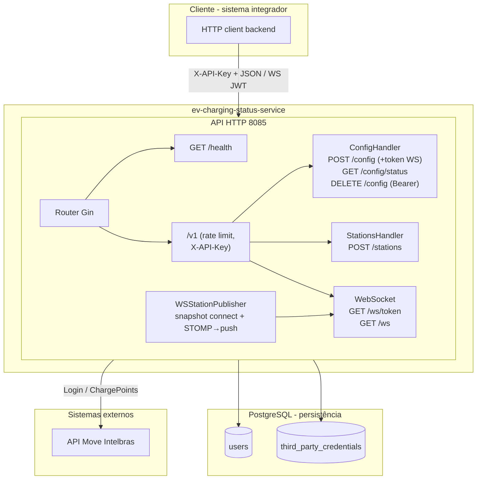

# EV Charging Status Service

Microserviço em Go para monitoramento de estações de recarga (EV). Autentica na API Move/Intelbras, consulta estações e conectores e faz **push por WebSocket** (e `POST /v1/stations`) por usuário (JWT no handshake ou no header).

---

## Índice

- [Stack](#stack)
- [Arquitetura](#arquitetura)
- [Fluxo de dados](#fluxo-de-dados)
- [Variáveis de ambiente](#variáveis-de-ambiente)
- [Como rodar](#como-rodar)
- [API](#api)
- [Documentação Swagger](#documentação-swagger)
- [Migrations](#migrations)
- [Segurança](#segurança)
- [Estrutura do projeto](#estrutura-do-projeto)

---

## Stack

| Tecnologia | Uso |
|------------|-----|
| **Go 1.25** | Linguagem |
| **Gin** | API HTTP |
| **Gorilla WebSocket** | Conexão WS + JWT curto (`WS_JWT_SECRET` / fallback `API_KEY`) |
| **PostgreSQL** | Persistência (usuários, credenciais, estações, etc.) |
| **Docker / Docker Compose** | API e banco em containers |

Redis e Kafka estão no `go.mod` para uso futuro; na versão atual não são utilizados.

---

## Arquitetura



### Componentes

| Componente | Descrição |
|------------|-----------|
| **API** | Servidor HTTP (porta **8085**). Expõe `/health`, `POST /v1/config`, `GET /v1/config/status`, `DELETE /v1/config` (Bearer JWT), `POST /v1/stations` (Bearer JWT + `apiKey` no corpo), `GET /v1/ws/token`, `GET /v1/ws` (upgrade WebSocket, **só JWT**, sem `X-API-Key`), `GET /v1/ws/stats`. Rotas HTTP `/v1/*` (exceto handshake `/v1/ws`) usam `X-API-Key` se `API_KEY` definida; rate limit 15 req/min por IP no grupo `/v1`. |
| **Push WS (API)** | Ao abrir o WebSocket, **um** GET `/chargepoints` envia snapshot completo (`userId`, `stations`, `timestamp`). Depois, com `CSMS_STATUS_STOMP_ENABLED=true`, cada mudança vinda do **STOMP** do CSMS reenvia o **mesmo formato** (`userId`, `stations`, `timestamp`), com a lista atualizada em memória (sem poll periódico à API). |
| **PostgreSQL** | Armazena usuários e credenciais (senha e API key criptografadas com `ENCRYPTION_KEY`), além de tabelas de domínio (`stations`, `connector_status`, etc.). |

---

## Fluxo de dados

1. **Configuração**  
   `POST /v1/config` com email, senha e, se quiser, `apiKey` (Intelbras). A API faz login na Move/Intelbras e persiste credenciais (criptografadas se `ENCRYPTION_KEY` estiver definida). A resposta inclui **`token` e `expiresIn`** para abrir o WebSocket sem chamar `/v1/ws/token`.

2. **Consulta de estações (HTTP)**  
   `POST /v1/stations` com header `Authorization: Bearer <JWT>` (o mesmo do WebSocket) e corpo JSON `{"apiKey":"..."}` igual ao configurado em `/v1/config` (string vazia se não houver). Resposta: mesmo JSON do push WS (`userId`, `timestamp`, `stations`). Exige `X-API-Key` da API quando configurado.

3. **WebSocket**  
   - **Handshake:** `GET /v1/ws` com `?token=<JWT>` **ou** header `Authorization: Bearer <JWT>`. **Não** enviar `X-API-Key` nesta URL — apenas o JWT emitido por `POST /v1/config` ou `GET /v1/ws/token?username=`. Token inválido ou expirado (`WS_TOKEN_TTL_SECONDS`) → **401** JSON, sem upgrade.  
   - **Dados:** logo após o upgrade, **um** frame JSON no mesmo formato de `POST /v1/stations` (`userId`, `stations`, `timestamp`). Com STOMP ativo, o servidor envia **o mesmo JSON** sempre que o CSMS altera `status` / `errorCode` / `erroInfo` de um conector (lista completa, alinhada ao último GET de estações + patches do STOMP). Não há polling periódico à API para alimentar o WS.  
   - **Transporte:** Ping do servidor a cada **25 s** (responder com Pong); fila de **32** mensagens por conexão — cliente lento pode ser desconectado (backpressure). O servidor não revalida o JWT depois do handshake até o cliente reconectar.

---

## Variáveis de ambiente

Copie `.env.example` para `.env` e ajuste. No Docker Compose, as variáveis do `.env` são usadas no serviço `api`.

| Variável | Obrigatória | Descrição |
|----------|-------------|-----------|
| `POSTGRES_URL` | Sim | URL de conexão com o PostgreSQL (ex.: `postgres://user:pass@db:5432/charging?sslmode=disable`). |
| `INTELBRAS_BASE_URL` | Sim | Base da API Move/Intelbras (ex.: `https://cs-test.use-move.com/api/v1`). |
| `API_KEY` | Sim* | Chave para autorizar chamadas à API (`X-API-Key`). \* Use `ALLOW_EMPTY_API_KEY=true` só em dev. |
| `ENCRYPTION_KEY` | Não | Chave para criptografar senha e API key no banco. Pode ser UUID, senha ou base64 (32 bytes). Se vazia, dados ficam em texto. |
| `WS_JWT_SECRET` | Não* | Segredo para assinar o token curto do WebSocket. \* Se vazio, usa `API_KEY` como fallback. |
| `WS_TOKEN_TTL_SECONDS` | Não | TTL do token de conexão WS em segundos (default: `300`). |
| `CSMS_STATUS_STOMP_ENABLED` | Não | `true`/`false` — assina o CSMS (SockJS+STOMP) e, quando `status` / `errorCode` / `erroInfo` mudam, reenvia pelo WebSocket o mesmo payload `userId`+`stations`+`timestamp` (default: `true`). Com `false`, o WS só envia o snapshot inicial ao conectar. |
| `CSMS_SOCKJS_PREFIX` | Não | Prefixo SockJS no host da Move (default: `/ws`). |

---

## Como rodar

### Com Docker Compose (recomendado)

```bash
# Subir API e PostgreSQL
docker compose up -d --build

# Ver logs
docker compose logs -f
```

- **API**: http://localhost:8085  
- **Health**: http://localhost:8085/health  
- **Swagger**: http://localhost:8085/swagger/index.html  

### Aplicar migrations

Após o primeiro `up`, crie as tabelas (se ainda não existirem):

```bash
# Linux/macOS
cat migrations/001_init.sql migrations/002_webhook_events_payload_text.sql migrations/003_third_party_credentials_unique_user.sql migrations/004_drop_webhooks.sql | docker exec -i ev-charging-db psql -U postgres -d charging

# Windows (PowerShell)
Get-Content migrations/001_init.sql | docker exec -i ev-charging-db psql -U postgres -d charging
Get-Content migrations/002_webhook_events_payload_text.sql | docker exec -i ev-charging-db psql -U postgres -d charging
Get-Content migrations/003_third_party_credentials_unique_user.sql | docker exec -i ev-charging-db psql -U postgres -d charging
Get-Content migrations/004_drop_webhooks.sql | docker exec -i ev-charging-db psql -U postgres -d charging
```

**Banco externo ou Beekeeper:** abra o SQL da pasta `migrations/` (incluindo `003_...`) e execute na ordem no seu Postgres; o `003` remove credenciais duplicadas por `user_id` e cria índice único (necessário para o upsert e para evitar rajadas no WebSocket).

### Local (sem Docker)

1. PostgreSQL rodando e banco `charging` criado.  
2. Defina as variáveis de ambiente. O `go run` **não carrega `.env` sozinho**; no PowerShell você pode injetar o arquivo antes de rodar ou exportar `POSTGRES_URL`, `API_KEY`, etc. manualmente.  
3. Rode a API:

```bash
go run cmd/api/main.go
```

---

## API

| Método | Rota | Descrição |
|--------|------|-----------|
| GET | `/health` | Health check (sem autenticação). |
| POST | `/v1/config` | Configura credenciais (email e password obrigatórios; `apiKey` opcional). Resposta: `token` (JWT WS) e `expiresIn`. Requer `X-API-Key` se `API_KEY` estiver definida. |
| DELETE | `/v1/config` | Remove o usuário identificado pelo JWT: header `Authorization: Bearer <token>`. Requer `X-API-Key` se `API_KEY` estiver definida. Resposta 204. |
| GET | `/v1/config/status` | Retorna se há configuração e se o token Intelbras está presente (sem expor tokens). Requer `X-API-Key` quando configurado. |
| POST | `/v1/stations` | Corpo `{"apiKey":"..."}`; header `Authorization: Bearer <JWT WS>`. Retorna `userId`, `timestamp`, `stations` (igual ao push WebSocket). Requer `X-API-Key` quando configurado. |
| GET | `/v1/ws/token?username={email}` | Emite JWT para handshake WS (`token`, `expiresIn`). O `username` é o e-mail já configurado. Requer `X-API-Key` quando configurado. |
| GET | `/v1/ws` | Upgrade para WebSocket. Autenticação **somente** com `?token=` ou `Authorization: Bearer` (sem `X-API-Key`). Ver seção *Fluxo de dados* para snapshot inicial e eventos STOMP. |
| GET | `/v1/ws/stats` | Métricas do hub WS (conexões, mensagens, drops por backpressure). Requer `X-API-Key` quando configurado. |

Respostas de erro usam mensagens genéricas (`invalid request`, `configuration failed`, `stations unavailable`, etc.); o detalhe é logado no servidor.

---

## Documentação Swagger

A documentação OpenAPI (Swagger) está disponível com a API rodando:

- **UI**: [http://localhost:8085/swagger/index.html](http://localhost:8085/swagger/index.html)
- **JSON**: [http://localhost:8085/swagger/doc.json](http://localhost:8085/swagger/doc.json)

Para regenerar a spec a partir dos comentários no código (requer [swag](https://github.com/swaggo/swag)):

```bash
go install github.com/swaggo/swag/cmd/swag@latest
swag init -g cmd/api/main.go -o docs
```

---

## Migrations

| Arquivo | Descrição |
|---------|-----------|
| `001_init.sql` | Cria tabelas iniciais (inclui `webhooks` e `webhook_events` por compatibilidade com instalações antigas). |
| `002_webhook_events_payload_text.sql` | Altera `webhook_events.payload` de JSONB para TEXT (histórico; removido na `004`). |
| `003_third_party_credentials_unique_user.sql` | Remove credenciais duplicadas por `user_id`, cria índice único e permite `UPSERT` correto por usuário (evita rajadas no WebSocket). |
| `004_drop_webhooks.sql` | Remove tabelas `webhook_events` e `webhooks` (funcionalidade descontinuada). |
| `clear_data.sql` | Limpa todos os dados (TRUNCATE), mantendo a estrutura. |

---

## Segurança

- **API_KEY**: Exigida no startup (exceto com `ALLOW_EMPTY_API_KEY=true`). Usada no header `X-API-Key` nas rotas `/v1/*`.  
- **WS_JWT_SECRET**: Assinatura do JWT do WebSocket; se vazio, usa `API_KEY` como fallback (recomenda-se segredo dedicado em produção).  
- **ENCRYPTION_KEY**: Criptografia AES-256-GCM para senha e API key da Intelbras no banco.  
- **Rate limit**: 15 requisições/minuto por IP no grupo `/v1`.  
- **Isolamento WS**: O hub só encaminha para conexões cujo JWT contém o mesmo `userId`; o payload é montado com `GetStationsByUserID` (credencial daquele usuário).  
- **Handshake WS**: `/v1/ws` não valida `X-API-Key`; quem protege a sessão é o JWT (curta duração).  
- **Erros**: Respostas 4xx/5xx com mensagens genéricas; corpo de erro do login de terceiros não é exposto ao cliente.  
- **Logs**: Dados sensíveis não são logados em claro.

---

## Estrutura do projeto

```
ev-charging-status-service/
├── cmd/
│   └── api/           # Entrypoint da API
├── docs/              # Swagger (gerado por swag)
├── internal/
│   ├── api/           # Handlers, rotas, rate limit, WebSocket (hub + handler)
│   ├── clients/
│   │   └── intelbras/ # Cliente HTTP (login + charge-points)
│   ├── config/        # Carregamento de env
│   ├── crypto/        # Criptografia (ENCRYPTION_KEY)
│   ├── database/      # Conexão PostgreSQL
│   ├── repository/    # Acesso a dados
│   └── service/       # Regras de negócio (config, stations, auth WS, publisher WS)
├── migrations/        # SQL de schema e utilitários
├── docker-compose.yml
├── Dockerfile         # Multi-stage: imagem da API
├── go.mod
├── .env.example
└── README.md
```
